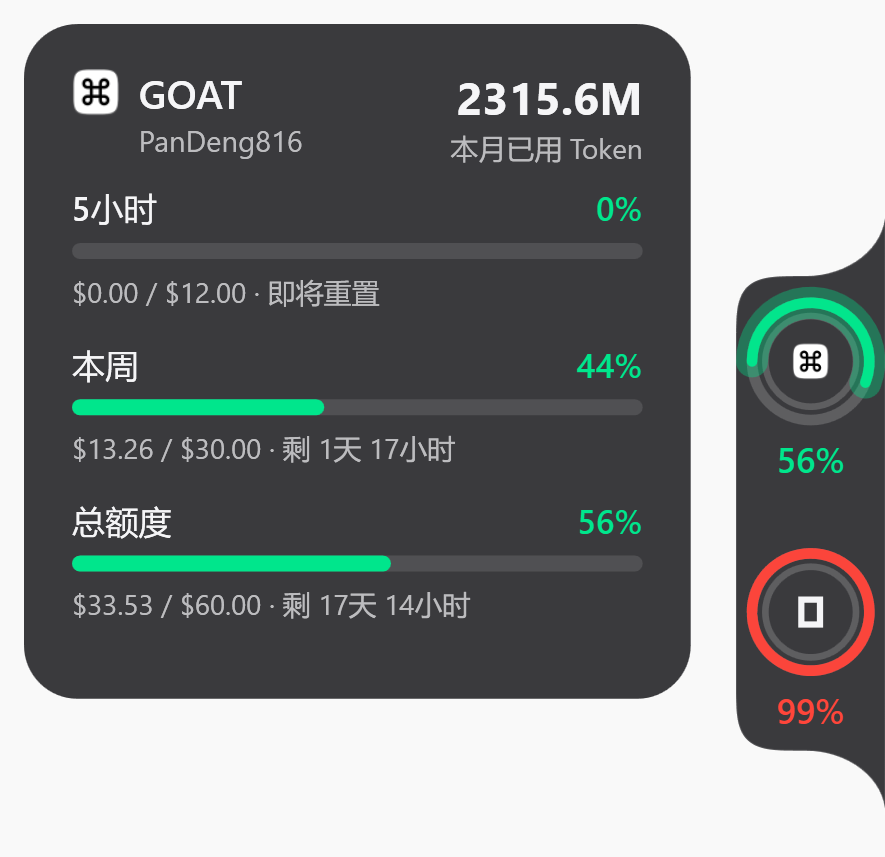
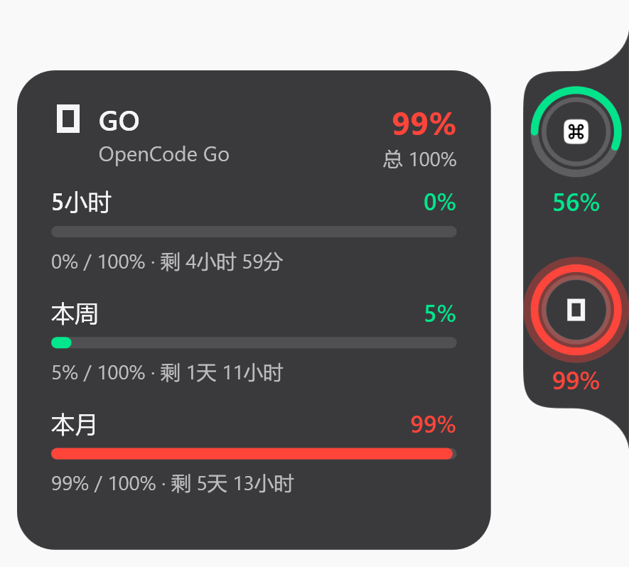
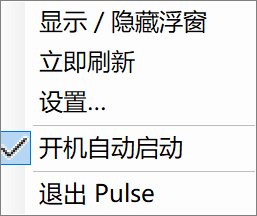

# Pulse for Windows

一个 Windows 11 屏幕边缘的 AI 额度浮窗:黑色玻璃 rail 上,每个订阅一个
**复合同心环**(内细圈 = 5 小时用量,外粗圈 = 月总额度),用量 ≤80% 绿色、
>80% 红色报警;hover 弹出三池明细卡。数据源:Command Code GOAT、OpenCode Go
与 DeepSeek(余额),自动 60 秒同步,不依赖任何第三方服务。

展示层还原自 [qunqin24/Pulse](https://github.com/qunqin24/Pulse)(macOS),
数据层移植自
[ahuud251/goat-go-usage-monitor](https://github.com/ahuud251/goat-go-usage-monitor)。
见 [THIRD-PARTY-NOTICES.md](THIRD-PARTY-NOTICES.md)。

## 预览

贴边 rail 上的复合同心环:内细圈 = 5 小时用量,外粗圈 = 月总额度;
阈值内绿色,超过报警线转红(下例中 GOAT 56% 绿、OpenCode Go 99% 红)。
鼠标悬停弹出该订阅的明细卡——三个时间池各自的百分比条、已用量与重置倒计时:

| Command Code GOAT 明细卡 | OpenCode Go 明细卡 |
|---|---|
|  |  |

托盘右键菜单:显示/隐藏浮窗、立即刷新、设置、开机自动启动、退出:

<p align="center"></p>

## 下载

**免安装**:到 [Releases 页面](https://github.com/PanDeng816/PulseWin/releases/latest)
下载 `PulseWin.exe`,双击即用(自包含单文件,无需安装 .NET)。
数据保存在 exe 同目录的 `Data\` 下,卸载 = 删除整个文件夹。

## 功能

- 屏幕右/左/上边缘停靠或自由浮动;鼠标探到边缘滑出,移开 0.9s 自动隐藏
- **空闲时几乎不耗电**:主循环按需在 60fps(有动画/指针在 rail 上)与 10fps(静止)
  之间切换,静止藏屏外时一帧都不重绘——实测 idle CPU ≈ 0%、私有内存约 175MB
- **工具窗按需读取、用完即还**:套餐用量页与用量统计窗共用**同一份账本**(引用计数,
  谁都不用了立刻释放),不再各读一遍本机两个库;关掉窗口后内存随即回落
- 每订阅一个复合环:内圈 = 5小时用量,外圈 = 月总额度(周额度在 hover 卡内)
- DeepSeek 是**余额型**数据源,只占一圈:要么按所选基准画百分比,要么直接显示
  余额金额(详见下文)
- **环尺寸固定、显示哪些源可选**:设置里勾选要显示哪几个;关掉的既不显示、不占高度,
  **也不再对它发请求**(不是"照旧每 60 秒打一次接口、只是不画环")。多一个源 rail 就长
  一截,环本身不缩
- **读数可隐藏**:关掉后 rail 是一条纯环列,环间距与整体高度同步收窄
- 报警线(默认 80%,可调):阈值内绿、超过转红、封顶深红
- hover 卡片:三池各自的百分比条、已用量、重置时间;数据超过 3 分钟没更新时
  会标出"⚠ 数据 X 分钟前 · 未能刷新"
- 点击环 = 立即刷新(真的会打一次接口,弧变暗 + 亮段游走直到数据回来;亮段**至少
  显示 650ms**,免得一闪而过让人以为没刷)
- **rail 上点右键 = 菜单**(显示/隐藏、立即刷新、用量统计、设置、退出):命中范围与
  拖动完全一致,所以**能拖动的地方就能右键**;菜单每次点击现构建,刚查到的新版本
  立刻就在里面
- **环心呼吸 = ZCode 正在跑**:ZCode 在跑一轮的时候,GOAT 环的图标会轻轻呼吸
  (缩放 92%~100%,约 1.2 秒一轮)。判定读的是 ZCode 自己的应用日志里 `turn.started`
  与 `turn.completed` / `turn.failed` 的配对——**不是"最近若干秒有写入"**:跑长命令时
  它误灭、回合结束后又会因为客户端继续写记账信息而永远亮着。等待超时按"这一轮在等
  什么"分档(等工具 5 分钟、等模型 90 秒)
- **至少保留一个数据源**:取消最后一个勾选时会自动弹回并说明原因——三个全关之后
  浮窗上就什么都没有了
- **每个源可自定义圆环颜色**(`#RRGGBB`):不填就还是"按用量着色";用满时一律深红
- **自动检查更新**:每两小时查一次 GitHub Release,**只提示、不自动安装**
- **用量统计窗口**(托盘右键 → 用量统计):见下文
- 托盘:双击显示/隐藏、右键菜单(立即刷新、用量统计、设置、开机自动启动、退出)
- 只允许运行一个实例:重复启动会唤醒已有窗口,不会起第二个浮窗

## 额度口径(GOAT)

Command Code 的服务端只发**剩余额度**、不发上限,而且 GOAT 的额度单位是
**credits(用量价值单位)而不是美元**,池子是固定的 70 credits:

```
月上限 = 70 credits(5小时 cap 14、周 cap 35 正是它的 20%/50%,同一刻度)
已用   = 70 − 服务端 remaining
百分比 = 已用 / 70                # 只依赖固定池子,与所选模型无关
```

界面上一律显示 **credits 原值 + 百分比,不做美元折算**。"1 credit 值多少美元"要先
知道所选模型的 monthly allowance,而那是官方随时会调的数(V4.1 Flash 常态 $40,
2026-09-11~09-20 曾限时提到 $60,之后又回落),换个模型也会变。把显示建立在这个数上,
官方一调、或换一个 allowance 不同的模型,同一份服务端数据就会被折成另一个金额,
切换日还能看到"已用"凭空跳变——那就不是服务端给的原始事实了。参见
`Services/CommandCodeApiClient.cs` 里的 `CreditUnit`。

**高峰/低谷已自动计入**:服务端按请求发生时刻的实际单价扣 credit(高峰价是错峰的
2 倍),所以高峰时段额度掉得更快——百分比本身就是"实际花费"的口径,工具无需额外换算。

## 余额口径(DeepSeek)

DeepSeek 和另外两个源的根本差别:**它卖的是预付余额,不是套餐**。接口只有一条,
而且是官方文档里的:

```
GET https://api.deepseek.com/user/balance
→ {"is_available": true, "balance_infos": [{"currency":"CNY","total_balance":"110.00",
   "granted_balance":"10.00","topped_up_balance":"100.00"}]}
```

回包里**没有额度、没有窗口、没有重置时间**,API 里也没有消费历史。所以"环"要画
百分比就缺一个分母,本程序给三个来源,在设置里选:

| 基准 | 分母 | 环上显示 |
|---|---|---|
| **自上次充值**(默认) | 本程序观察到的历史最高余额 | `(峰值 − 余额) / 峰值` → 百分比 |
| 只看余额 | 没有 | 不画百分比,直接显示 `¥42.3` |
| 我的预算 | 你填的"满箱"金额 | `(预算 − 余额) / 预算` → 百分比 |

默认用"自上次充值",因为它的分母是**观察出来的**而不是猜的:余额上涨只可能是充值,
所以一涨就把峰值重置回满。代价是首次运行没有历史峰值,环从 0% 开始,直到真的花了
钱——那是关于"本程序看到了什么"的真实陈述。峰值按**币种**各存一份
(`Data\deepseek-baseline.json`),因为一个账户可以同时持有 CNY 和 USD,两者不能相加
也不能跨币种比大小。

另外两条口径:环上的金额用**截断**而非四舍五入的短写法(显示得比实际多是错错了
方向),精确值在 hover 卡里;只有 DeepSeek 自己的 `is_available` 能表示"账户花光
了",自设预算走到 100% 不算——那是你画的线,不是 DeepSeek 的判定。

### 卡片里的"今日消耗"柱状图

DeepSeek 的 API **不提供任何用量或消费历史**,所以拿不到真实的 token 数。卡片上
那张柱状图是本程序**自己观察**出来的:每次同步成功记下余额(每小时留一个点),相邻
两个小时的差额就是那一小时的消耗。

也就是说它衡量的是"余额下降",不是账单。**程序没运行的那些小时没有采样,柱子上是
空的**——宁可缺一根柱子,也不能把"没看见"画成"没花钱"。数据按币种分开存
(`Data\deepseek-ledger.json`,保留最近 7 天),余额上涨(充值)的那一小时记 0。

卡片脚注同时给出 `topped_up_balance` / `granted_balance` 的拆分(这是 DeepSeek 回包
直接提供的),所以能一眼看出余额里有多少是自己充的。

## 用量统计

托盘右键 → **用量统计**,或给 exe 加 `--spend-window` 参数。它回答的是另一个问题:
**这段时间的活干到哪儿去了**——按天、按模型、按项目、按会话分组,以及按厂商公开的
API 牌价折算出来的估算金额。它是自成一体的窗口,不在 rail 上:这是坐下来看的东西,
不是瞥一眼的东西。

**数据从本机来,不发任何请求**:

| 来源 | 读什么 | 粒度 |
|---|---|---|
| ZCode | `~\.zcode\cli\db\db.sqlite` 的 `model_usage` 表(连 `session` 取项目/标题) | 每次请求 |
| OpenCode | `~\.local\share\opencode\opencode.db` 的 `message` 表(助手消息里的 `tokens`) | 每条消息 |

口径上死守几条规矩(与上游 Pulse 一致),宁可少显示也不显示错的数:

- **四类 token**:输入(新鲜部分)、缓存写、缓存读、输出。**分类之和必须能对上来源
  报告的总量**——对不上的差额进"未分类",计入总数但**绝不塞进输入、也绝不参与计价**。
  (ZCode 的 schema 里 `input_tokens` 含缓存、`output_tokens` 含推理,所以输入侧要减掉
  缓存重叠、推理不再加第二次;OpenCode 的 `reasoning` 则要并进输出。)
- **金额一律来自牌价**,不用来源自己记的 `cost` 字段(那是它当时的理解,套餐没价目时
  就是 0)。牌价取自 [models.dev](https://models.dev),**第一方厂商价永远优先**,查不到
  才退到套餐价(如只在 `opencode-go` 上架的 `deepseek-v4.1-flash`)。
- **查不到价的模型只计 token、不显示金额**,并明确标出来——一个猜出来的价格看起来
  像对的数字,比没有更糟。列表里金额显示 `—` 是"算不出来"(不是"没花钱"),带 `*` 的是
  **只覆盖有价部分的小计**;真实 0 元的免费模型照旧显示 `$0.00`
- **牌价表会自己更新**:内置那份是打包时的快照,过期(超过 7 天)之后打开统计窗口会在
  后台拉一份新的 models.dev 全量、按厂商白名单裁剪后写进 `Data\model-prices.json`,
  下一次读取即生效;**失败就继续用旧的**,五分钟后再试。只收模型原厂与在售套餐厂商,
  两百多个转售商一个都不进(否则转售商会按字母序抢在原厂前面决定价格)
- **项目身份与显示名是两件事**:项目的身份是完整工作目录——`D:\work\a\api` 与
  `D:\work\b\api` 是两个项目,用量不会并成一行;显示时默认只给末段目录名,末段撞名
  才往上补一段(如 `06Learning\03_工作资料`)。逐日聚合存在本地仓库
  (`Data\usage-history.sqlite`),源库清理旧记录之后历史还在
- **读不出来的来源要说出来**(库被锁、结构变了),而不是当成 0。
- **金额是按公开 API 价折算的估算,不是账单**;套餐内调用看起来"很便宜"是因为套餐
  已经把边际成本预付掉了。

区间可选 今天 / 近 7 天 / 近 30 天 / 全部(默认近 7 天),换区间只重算加法,不重读库。

## 套餐用量页

设置 → **套餐用量**(左侧"数据"分组下)。它按**套餐/渠道**分页——每个套餐一个按钮,
点哪个看哪个,每页都是这个套餐的完整画像:

- **套餐切换**:Command Code GOAT / OpenCode Go / BigModel 包月 / DeepSeek … 各一个按钮,
  按钮上带该套餐的总量。同一个套餐的多种 provider 写法会**合并成一个**
  (OpenCode Go 的 `opencode-go` / `-glm` / `-responses`,BigModel 的 `builtin:` 与 `account:`)
- **订阅过、这段没用过的套餐也一直在**:凡是客户端配置里存在的套餐都会列出,
  本区间零用量的会标"本区间无用量"并显示最后使用日期(`未启用` 表示客户端配置里关着,
  历史用量仍照实统计)——不会因为"最近没续订"就从列表里消失
- **KPI 六格**:总费用(含均价/次)、总请求、总 TOKEN(含输入/输出)、缓存命中率(含命中量)、
  缓存读 / 写、会话数
- **Token 构成六格**:输入 / 输出 / 缓存读 / 缓存写 / 未分类 / 合计
- **今日逐小时**:0~23 点的用量柱状图(输入与输出分色堆叠),标出最忙时段
- **每日用量**:区间内逐日柱状图(没有记录的那天画一条淡线,不是 0)
- **性能与行为**(来自客户端记录的每次调用遥测):推理占输出、平均耗时、平均首字延迟、
  工具调用(含次数/请求)、重试(含占比)、平均每请求 token
- **这个套餐里各模型的用量**:模型 + 占比条 + 总量 / 次数 / 缓存命中率 + 估算金额
- **逐日明细**:每行一个模型、每列一天(最近 6 天)的 token 矩阵,悬浮看当天次数与金额
- **归属信息**:实际用到的 provider id、来源客户端、与统计窗口一致的口径说明

区间与统计窗口一样(今天 / 7 天 / 30 天 / 全部)。数据来源同源(本机 ZCode / OpenCode
记录库,不发请求),口径也完全一致:四类 token 之和对不上来源总量时差额记"未分类"
(计入总数、不计价),金额按 models.dev 公开牌价估算。

### 套餐是怎么认出来的

本机用量记录里只有 `provider_id`(ZCode 是 UUID 或 `builtin:xxx` 这类字符串,
OpenCode 是 `opencode-go`),直接拿来当分组键会显示成没人看得懂的一串。
`ChannelRegistry` 把 id 翻成套餐名:**优先读 ZCode 自己的 provider 配置**
(`~\.zcode\v2\provider_config.json` 里有 providerId→providerName 的权威映射),
读不到再退回内置规则(opencode-go-* 前缀、bigmodel-* 前缀等)。
两者都认不出的 id 会原样显示成短标签,**宁可不认识也不丢数据**。

### 可选:浏览器会话明细(默认关)

这一页有一个**浏览器会话明细**开关,开了之后会读本机浏览器(Edge/Chrome)的登录 cookie,
去抓 Command Code 只有登录态才开放的逐模型缓存明细(逐模型缓存读/写 token)。

**默认关**,两个实际理由:

1. **读 cookie 可能被杀毒软件误判**。同类工具 CodexBar-Win 就因为"解密浏览器 cookie
   读配额"被 AV 全家误判成 infostealer,最后撤掉了全部二进制。这是真实前车之鉴。
2. **浏览器运行时读不到**。Chromium 系的 cookie 数据库是**排他锁定**的——本机实测
   连只读共享打开都失败(`WinError 32`),所以基本要等浏览器完全退出才有机会读到。

**不开这个开关,套餐页也完整可用**(本地库本来就有逐模型的 token 与缓存读/写)。

## 运行

需要 Windows 10/11。两种方式:

```powershell
# 开发运行(需 .NET 8 SDK)
dotnet run

# 单文件成品(自包含,免安装)
dotnet publish -c Release -r win-x64 --self-contained true `
  -p:PublishSingleFile=true -p:IncludeNativeLibrariesForSelfExtract=true `
  -p:EnableCompressionInSingleFile=true -o publish
.\PulseWin.exe
```

`EnableCompressionInSingleFile` 把自包含产物从 ~154MB 压到 ~70MB,代价是首次
启动多花一点解压时间。日常使用的 `PulseWin.exe` 放在仓库根目录,便携数据
`Data\`(凭据/用量历史)必须与它同目录,挪 exe 时记得一起挪。

几个**只输出结果、不开界面**的诊断参数(走的是与界面完全相同的那套口径代码):

| 参数 | 作用 | 输出 |
|---|---|---|
| `--spend` | 把用量统计的原始数字打出来(核对口径用,别靠截图) | `Data\spend-dump.txt` |
| `--models` | 把逐模型聚合、套餐/渠道聚合与浏览器会话通道的状态打出来 | `Data\models-dump.txt` |
| `--update-prices` | 强制更新一次模型牌价表并等它做完 | `Data\price-update.txt` |
| `--activity [目录]` | 读 ZCode 活动日志并输出判定,可指定日志目录 | `Data\activity.txt` |

## 设置与数据

托盘 → **设置…**:
- 显示两个数据源的连接状态与凭据来源
- 可手动输入 API Key(先联网验证,通过后 DPAPI 加密保存并立即同步)
- 调整显示与刷新偏好,即时生效并写入 `Data\settings.json`:
  - **报警阈值**(50%~99%,默认 80%)
  - **背景不透明度**(30%~100%,默认 80%)
  - **同步间隔**(15~300 秒,默认 60 秒)
  - **显示哪些圆环**(至少留一个)、**环下是否显示读数**
  - **每个源的圆环颜色**(留空 = 按用量着色)
  - **自动隐藏**的两个开关(见下)
  - **网络代理**(跟随系统/直连/手动 HTTP;**重启后生效**)

### 关于"液态玻璃"(v1.7.3 已移除)

v1.7.0 曾加过一个"液态玻璃"开关(用 `SetWindowCompositionAttribute` 开系统 acrylic 模糊),
**v1.7.3 已整体删除**。原因是它带来两个无法调和的代价,而视觉收益几乎为零:

- 模糊区域只能是**整个窗口矩形**,跟不了 rail/卡片的圆弧轮廓 —— 一开就把所有圆角变成直角
  (v1.7.0 与 v1.7.1 因此被连否两次)。
- 在分层窗口上调用它会**不可逆地打坏 per-pixel alpha**,圆角与半透明一起失效 ——
  v1.7.2 修的"圆弧和透明度都没了"就是它(`ACCENT_DISABLED` 也会打坏)。
- 实际观感只是 80% 黑 tint 平铺一块,在浅色桌面上看不出"玻璃"。

面板本来就是自绘的黑色玻璃(背景不透明度可调),不需要系统模糊。

### 关于"自动隐藏"的两个开关

- **隐藏时收成贴边小条**:关闭(默认)时,不用就把整条 rail **完全滑出屏幕外**;
  打开则只折叠成贴在屏幕边缘的 6pt 细条(有源越过报警阈值时细条会染色),
  指针靠近热区即展开。
- **全屏时隐藏**:前台是全屏应用(视频/游戏/演示)时自动收起,且**收起期间指针到屏边
  也不会弹出**(否则全屏看视频时鼠标一晃到边缘就被拉出来,这个开关等于没开);
  退出全屏后指针到屏边即可唤回。

> v1.7.3 修的正是这两个:"收成贴边小条"以前无论开关与否都只在屏边留 6pt
> (既不是细条也没真正隐藏),细条还画在屏外看不见;"全屏时隐藏"收起后热区
> 立刻又能把它拉回来。两个开关现在都真的起作用了。

凭据自动发现顺序(与 GOAT-Go-Usage-Monitor 一致):
- Command Code GOAT:环境变量 `COMMAND_CODE_API_KEY` → `~\.commandcode\auth.json` → DPAPI 手动存储
- OpenCode Go:环境变量 `OPENCODE_GO_API_KEY` → `~\.local\share\opencode\auth.json` 中 opencode-go 登录态 → DPAPI 手动存储
- DeepSeek:环境变量 `DEEPSEEK_API_KEY` → DPAPI 手动存储。它没有可借用的 CLI 登录态
  (Key 只存在于 DeepSeek 控制台),所以没配 Key 时这个环不显示,也不会拖慢另外两个源
  的刷新节奏

## 隐私

- **无硬编码密钥、无遥测、无第三方服务器**:请求只发给 Command Code / OpenCode 官方接口
- 所有数据(用量快照、加密凭据、设置)存在 **exe 同目录 `Data\`**(不可写时回退
  `%LOCALAPPDATA%\PulseWin`),首次启动会自动迁移旧
  GOAT-Go-Usage-Monitor 目录的数据
- API Key 用 Windows DPAPI 按当前用户加密(`credential.bin`),只有本机本用户可解密
- 接口异常会记到 `Data\diagnostics.json`(最近 100 条),不含密钥
- 上传/分发源码时请勿包含 `bin/`、`obj/`、`publish/`、`Data/`(见 `.gitignore`)

## 免责声明

非官方社区工具,与 Command Code、OpenCode 及其运营方无隶属或背书关系。
